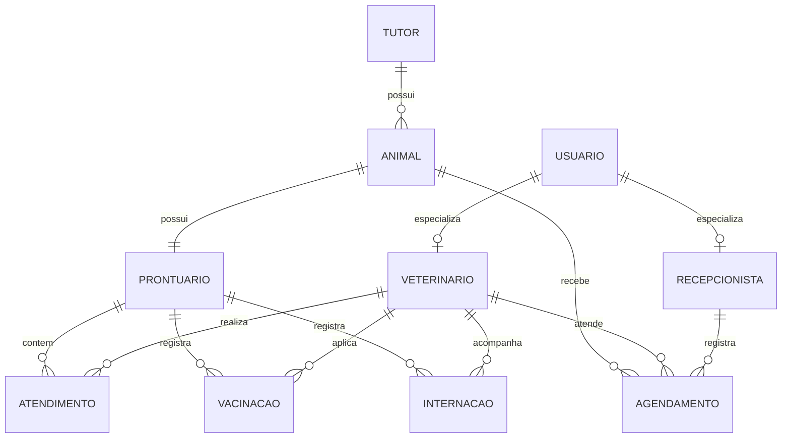

# DER — Pet & Gatô

## 1. Diagrama

## 2. Dicionário de dados

### Tabela: [Usuario]
| Campo | Tipo | Restrições | Descrição |
|---|---|---|---|
| Id | SERIAL | PK | Identificador do operador no sistema |
| Nome | VARCHAR(120) | NOT NULL | Nome completo |
| Email | VARCHAR(160) | NOT NULL, UNIQUE | Login coorporativo |
| Senha_hash | VARCHAR(255) | NOT NULL | Senha criptografada atendendo requisitos fortes (#3) |
| Perfil | VARCHAR(20) | NOT NULL, CHECK IN | Perfil de controle de acesso (#9) |

### Tabela: [Veterinário]
| Campo | Tipo | Restrições | Descrição |
|---|---|---|---|
| Id | SERIAL | PK | Identificador do veterinário |
| Usuário_id | INT | FK -> Usuário.id, NOT NULL, UNIQUE | Vinculação de conta |
| Crmv | VARCHAR(20) | NOT NULL, UNIQUE | Registro profissional do CRMV |
| Especialidade | VARCHAR(80) | NOT NULL | Especialidade Médica |

### Tabela: [Recepcionista]
| Campo | Tipo | Restrições | Descrição |
|---|---|---|---|
| Id | Serial | PK | Identificador da recepcionista |
| Usuario_id | INT | FK -> usuario.id, NOT NULL, UNIQUE | Vinculação de conta |
| Turno | VARCHAR(20) | NOT NULL | Turno de trabalho |

### Tabela: [Tutor]
| Campo | Tipo | Restrições | Descrição |
|---|---|---|---|
| Id | SERIAL | PK | Identificador do Tutor |
| Nome | VARCHAR(120) | NOT NULL | Nome completo |
| Cpf | VARCHAR(14) | NOT NULL, UNIQUE | Cpf com bloqueio de duplicidade (#1) |
| Cidade | VARCHAR(80) | NOT NULL | Cidade de residência (#1) |
| Email | VARCHAR(160) | NOT NULL | Email de contato (#1) | 
| Contato | VARCHAR(20) | NOT NULL | Telefone / Whatsapp (#1) |
| Observações | TEXT | | Observações adicionais (#16)|

### Tabela: [Animal]
| Campo | Tipo | Restrições | Descrição |
|---|---|---|---|
| Id | SERIAL | PK | Identificador do Pet | 
| Tutor_id | INT | FK -> tutor.id, NOT NULL | Tutor proprietário (Relação 1:N) (#2) |
| Nome | VARCHAR(80) | NOT NULL | Nome do pet (#2) |
| Tipo_animal | VARCHAR(40) | NOT NULL | Cão,gato,ave, etc (#2) | 
| Raça | VARCHAR(60) | | Raça ou SRD (Sem raça definida) |
| Sexo | CHAR(1) | CHECK IN('M','F') | Sexo biológico | 
| Data_nascimento | DATE | | | Data de nascimento para cálculo da idade |  

### Tabela: [Prontuário]
| Campo | Tipo | Restrições | Descrição |
|---|---|---|---|
| Id | SERIAL | PK | Identificador do prontuário |
| Animal_id | INT | FK -> animal.id, NOT NULL, UNIQUE | Prontuário único por paciente (1:1)(#4,#7) |
| Data_abertura | TIMESTAMP | NOT NULL, DEFAULT NOW () | Registro de abertura da ficha clinica |

### Tabela: [Agendamento]
| Campo | Tipo | Restrições | Descrição |
|---|---|---|---|
| Id | SERIAL | PK | Identificador do agendamento |
| Animal_id | INT | FK -> animal.id, NOT NULL | Paciente agendado |
| Veterinario_id | INT | FK -> veterinario.id, NOT NULL | Veterinário escalado |
| Recepcionista_id | INT | FK -> recepcionista.id, NOT NULL | Recepcionista que efetuou a reserva |
| Data_hora | TIMESTAMP | NOT NULL | Data e horário reservado (#5) |
| Status | VARCHAR(20) | NOT NULL, DEFAULT 'Agendado', CHECK IN ('Agendado','Em Espera','Em Atendimento','Concluído','Cancelado') | Fluxo de atendimento da recepção (#6, #8) |
| Motivo | VARCHAR(160) | | Motivo inicial da consulta |

### Tabela: [Atendimento]
| Campo | Tipo | Restrições | Descrição |
|---|---|---|---|
| Id | SERIAL | PK | Identificador do atendimento clínico |
| Prontuario_id | INT | FK -> prontuario.id, NOT NULL | Histórico do animal (#7, #8) |
| Veterinario_id | INT | FK -> veterinario.id, NOT NULL | Veterinário que realizou a consulta (#7) |
| Data_hora | TIMESTAMP | NOT NULL, DEFAULT NOW () | Data e hora do atendimento |
| Peso_atual | NUMERIC(5,2) | NOT NULL, CHECK (peso_atual > 0) | Peso aferido no atendimento (#7, #8) |
| Queixa | TEXT | NOT NULL | Motivo relatado pelo tutor (#8) |
| Anamnese | TEXT | NOT NULL | Histórico e evolução dos sintomas (#8) |
| Diagnostico | TEXT | NOT NULL | Conclusão diagnóstica (#7, #8) |
| Conduta | TEXT | NOT NULL | Conduta clínica, exames e receitas prescritas (#7, #8) |

### Tabela: [Vacinacao]
| Campo | Tipo | Restrições | Descrição |
|---|---|---|---|
| Id | SERIAL | PK | Identificador do registro de vacina |
| Prontuario_id | INT | FK -> prontuario.id, NOT NULL | Prontuário vinculado (#4, #12) |
| Veterinario_id | INT | FK -> veterinario.id, NOT NULL | Profissional aplicador |
| Nome_vacina | VARCHAR(80) | NOT NULL | Identificação do imunizante |
| Lote | VARCHAR(40) | NOT NULL | Lote de fabricação |
| Data_aplicacao | DATE | NOT NULL | Data de aplicação |
| Data_proxima_dose | DATE | NOT NULL, CHECK (data_proxima_dose > data_aplicacao) | Cálculo da dose de reforço (#4, #12) |

### Tabela: [Internacao]
| Campo | Tipo | Restrições | Descrição |
|---|---|---|---|
| Id | SERIAL | PK | Identificador do registro de internação |
| Prontuario_id | INT | FK -> prontuario.id, NOT NULL | Ficha do animal internado (#14) |
| Veterinario_responsavel_id | INT | FK -> veterinario.id, NOT NULL | Médico responsável pelo caso (#14) |
| Data_entrada | TIMESTAMP | NOT NULL, DEFAULT NOW () | Início da internação |
| Data_alta | TIMESTAMP | CHECK (data_alta > data_entrada) | Encerramento da internação |
| Nivel_gravidade | VARCHAR(20) | NOT NULL, CHECK IN ('Baixa','Media','Alta','Critica') | Classificação de risco (#14) |
| Status | VARCHAR(20) | NOT NULL, DEFAULT 'Internado', CHECK IN ('Internado','Alta','Obito') | Status do paciente (#14) |
| Evolucao_plantao | TEXT | | Anotações da equipe de plantão (#13) |

