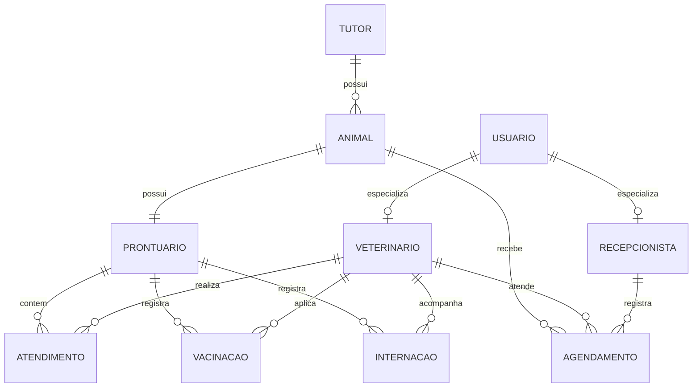

# DER — Pet & Gatô

## 1. Diagrama

## 2. Dicionário de dados

### Tabela: Usuario
| Campo | Tipo | Restrições | Descrição |
|---|---|---|---|
| Id_Usuario | INT | PK | Identificador do operador no sistema |
| Nome_Usuario | VARCHAR(120) | NOT NULL | Nome completo |
| Email_Usuario | VARCHAR(50) | NOT NULL, CHECK | Login corporativo |
| Senha | VARCHAR(50) | NOT NULL, CHECK |  |
| Perfil | VARCHAR(11) | NOT NULL, CHECK (Perfil IN('Recepcao', 'Veterinario')) |  |

### Tabela: Veterinário
| Campo | Tipo | Restrições | Descrição |
|---|---|---|---|
| CRMV | INTEGER | PK |  |
| CNPJ | VARCHAR(18) | NOT NULL, CHECK | PJ |
| Especialidade | VARCHAR(50) | NOT NULL |  |
| Id_Usuario | INT | FK -> Usuario.Id_Usuario, NOT NULL, UNIQUE |  |

### Tabela: Recepção
| Campo | Tipo | Restrições | Descrição |
|---|---|---|---|
| Matrícula | INT | PK | Número de matrícula CLT na empresa |
| CPF_Recepcao | VARCHAR(14) | NOT NULL, CHECK |  |
| Id_Usuario | INT | FK -> Usuario.Id_Usuario, NOT NULL, UNIQUE |  |

### Tabela: Tutor
| Campo | Tipo | Restrições | Descrição |
|---|---|---|---|
| Id_Tutor | INT | PK |  |
| Nome_Tutor | VARCHAR(120) | NOT NULL | Nome completo |
| CPF_Tutor | VARCHAR(14) | NOT NULL, UNIQUE, CHECK |  |
| Email_Tutor | VARCHAR(50) | CHECK |  | 
| Telefone | VARCHAR(15) |  |  |
| Observações | VARCHAR(300) |  |  |

### Tabela: Animal
| Campo | Tipo | Restrições | Descrição |
|---|---|---|---|
| Id_Animal | INT | PK |  | 
| Id_Tutor | INT | FK -> Tutor.Id_Tutor, NOT NULL |  |
| Nome | VARCHAR(30) |  |  |
| Tipo_animal | VARCHAR(15) | NOT NULL | Cão, gato, ave, etc | 
| Raca | VARCHAR(35) | NOT NULL | Raça ou SRD (Sem raça definida) |
| Sexo | CHAR | CHECK (Sexo IN('M','F')) |  | 
| Data_nascimento | DATE | | |  |  

### Tabela: Prontuário
| Campo | Tipo | Restrições | Descrição |
|---|---|---|---|
| Id_Prontuario | INT | PK |  |
| CRMV | INT | FK -> Veterinario.CRMV, NOT NULL |  |
| Id_Tutor | INT | FK -> Tutor.Id_Tutor, NOT NULL |  |
| Id_Animal | INT | FK -> Animal.Id_Animal, NOT NULL |  |
| Data_abertura | TIMESTAMP | NOT NULL, DEFAULT SYSDATE | Registro de abertura da ficha clínica |
| Peso_atual | NUMERIC(5,2) | NOT NULL, CHECK (peso_atual > 0) |  |
| Queixa | VARCHAR(300) | NOT NULL |  |
| Anamnese | CLOB |  | Histórico e evolução dos sintomas |
| Diagnostico | VARCHAR(200) | NOT NULL |  |
| Receita | VARCHAR(200) |  |  |
| Vacina | VARCHAR(200) |  |  |

### Tabela: Agendamento
| Campo | Tipo | Restrições | Descrição |
|---|---|---|---|
| Hora_Agendamento | TIMESTAMP | PK | Data e horário reservado |
| Id_Animal | INT | PK, FK -> Animal.Id_Animal, NOT NULL | Paciente agendado |
| CRMV | INT | PK, FK -> Veterinario.CRMV, NOT NULL | Veterinário escalado |
| Matricula | INT | FK -> Recepcao.Matricula, NOT NULL | Recepcionista que efetuou a reserva |
| Status_Agendamento | VARCHAR(15) | NOT NULL, DEFAULT 'Agendado', CHECK (Status_Agendamento IN ('Agendado','Em Espera','Em Atendimento','Concluído','Cancelado')) |  |

### Tabela: Atendimento
| Campo | Tipo | Restrições | Descrição |
|---|---|---|---|
| Id_Atendimento | INT | PK |  |
| Id_Prontuario | INT | FK -> Prontuario.Id_Prontuario, NOT NULL |  |
| Hora_Atendimento | TIMESTAMP | NOT NULL, DEFAULT SYSDATE |  |

### Tabela: Vacinacao
| Campo | Tipo | Restrições | Descrição |
|---|---|---|---|
| Data_Aplicacao | TIMESTAMP | PK |  |
| CRMV | INT | PK, FK -> Veterinario.CRMV, NOT NULL | Profissional aplicador |
| Id_Prontuario | INT | FK -> Prontuario.Id_Prontuario, NOT NULL | Prontuário vinculado |
| Nome_Vacina | VARCHAR(30) | NOT NULL |  |
| Lote_Vacina | VARCHAR(30) | NOT NULL |  |
| Data_Proxima_Dose | DATE | CHECK (data_proxima_dose > data_aplicacao) |  |

### Tabela: Internacao
| Campo | Tipo | Restrições | Descrição |
|---|---|---|---|
| Id_Internação | INT | PK |  |
| Id_Animal | INT | FK -> Animal.Id_Animal, NOT NULL |  |
| CRMV | INT | FK -> Veterinario.CRMV, NOT NULL | Médico responsável pelo caso |
| Data_Internacao | TIMESTAMP | NOT NULL, DEFAULT SYSDATE |  |
| Data_Alta | TIMESTAMP | CHECK (Data_Alta > Data_Internacao) |  |
| Nivel_Gravidade | VARCHAR(10) | NOT NULL, CHECK (Nivel_Gravidade IN ('Baixa','Media','Alta','Critica')) |  |
| Status_Internacao | VARCHAR(10) | NOT NULL, DEFAULT 'Internado', CHECK (Status_Internacao IN ('Internado','Alta','Obito')) |  |
| Evolucao_Internacao | CLOB |  | Anotações |

### Tabela: Plantao
| Campo | Tipo | Restrições | Descrição |
|---|---|---|---|
| Id_Plantao | INT | PK |  |
| Id_Animal | INT | FK -> Animal.Id_Animal | Caso cadastrado |
| Id_Tutor | INT | FK -> Tutor.Id_Tutor | Caso cadastrado |
| CRMV | INT | FK -> Veterinario.CRMV, NOT NULL |  |
| Chegada_Plantao | TIMESTAMP | NOT NULL, DEFAULT SYSDATE |  |
| Status_Plantao | VARCHAR(10) | NOT NULL, DEFAULT 'Em análise', CHECK (Status_Plantao IN ('Em análise', 'Internado','Alta','Obito')) |  |
| Evolucao_Plantao | CLOB |  | Anotações | 
