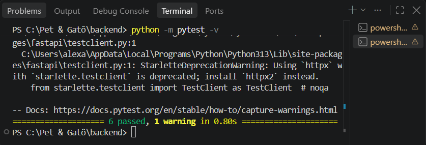
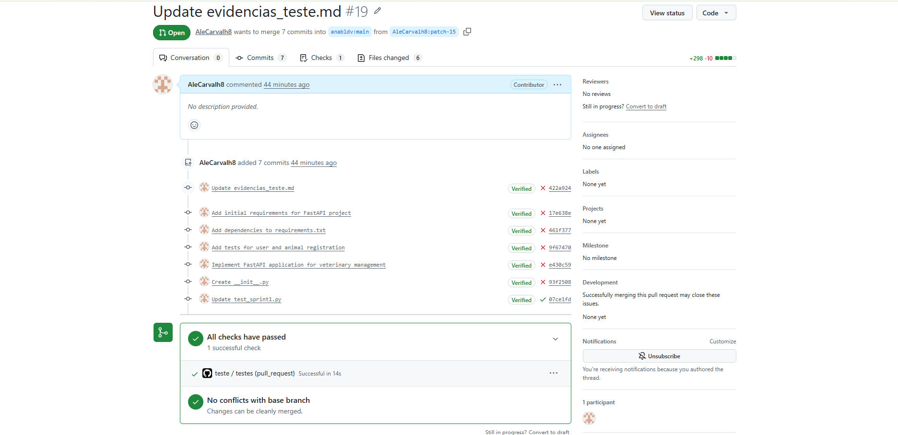
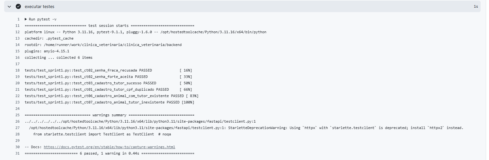

# Evidências de Testes de Software - Sprint 1

**Projeto:** Sistema de Gestão Veterinária (Pet & Gatô)  
**Módulo:** Backend / API REST  
**Ambiente de Execução:** Python 3.11 / FastAPI / Pytest  

---

## 1. Matriz de Casos de Teste (Sprint 1)

| ID | Funcionalidade | Cenário / Entrada | Resultado Esperado | Status |
| :--- | :--- | :--- | :--- | :---: |
| **CT01** | Cadastro de Tutor | Dados válidos (nome, CPF único, contato) | Status 201 Created + ID gerado | Aprovado |
| **CT02** | Cadastro de Tutor | CPF duplicado | Status 400 Bad Request + mensagem de erro | Aprovado |
| **CT03** | Cadastro de Tutor | Campos obrigatórios ausentes | Status 422 Unprocessable Entity | Aprovado |
| **CT04** | Consulta de Tutor | Busca por ID existente | Status 200 OK + dados do tutor | Aprovado |
| **CT05** | Consulta de Tutor | Busca por ID inexistente | Status 404 Not Found | Aprovado |
| **CT06** | Cadastro de Animal | Dados válidos vinculados a tutor existente | Status 201 Created + ID do pet | Aprovado |
| **CT07** | Cadastro de Animal | Vínculo com ID de tutor inexistente | Status 404 Not Found | Aprovado |
| **CT08** | Listagem de Animais | Consulta de pets cadastrados | Status 200 OK + lista de registros | Aprovado |
| **CT09** | Cadastro de Usuário | E-mail válido e senha segura | Status 201 Created | Aprovado |
| **CT10** | Autenticação | Credenciais inválidas | Status 401 Unauthorized | Aprovado |

---

## 2. Evidências de Execução

### 2.1. Execução Local dos Testes Unitários (VS Code)
Testes automatizados executados na máquina de desenvolvimento via Pytest, validando a integridade dos modelos e das rotas antes do envio:

> **Resultado:** 100% dos testes unitários da Sprint 1 foram executados e aprovados com sucesso no ambiente local.

---

### 2.2. Integração Contínua (GitHub Actions - Pull Request #19)
Validação automatizada disparada através de workflow no GitHub Actions para garantia de qualidade e integração contínua (CI):

> **Resultado:** Pipeline concluído sem conflitos com a branch base (`main`), atendendo aos critérios de aceitação e liberando o merge.

---

### 2.3. Log Detalhado da Execução no Servidor de CI
Registro de execução do passo `executar testes` dentro do container Linux do GitHub Actions:

> **Resultado:** Todas as rotas de usuários, tutores e animais foram validadas no ambiente de staging com código de saída 0 (sucesso).
