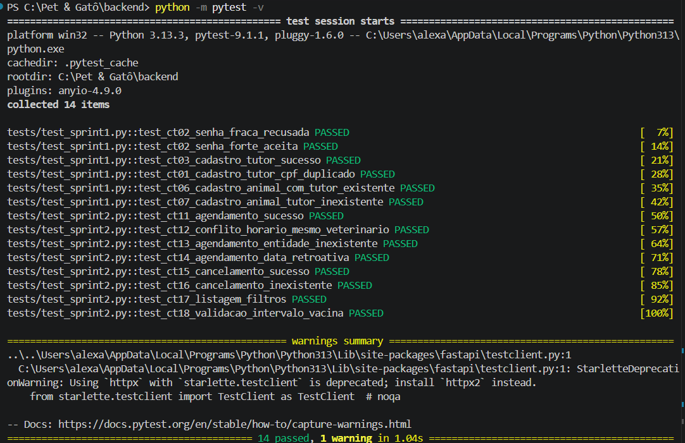
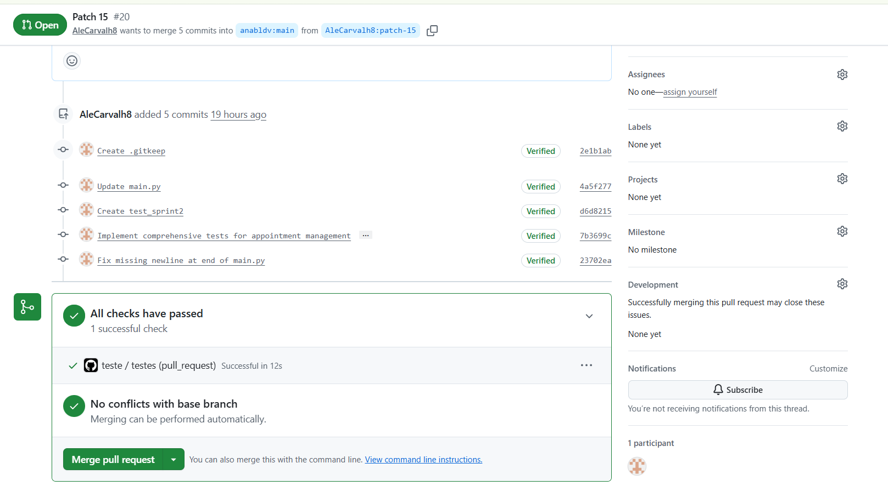
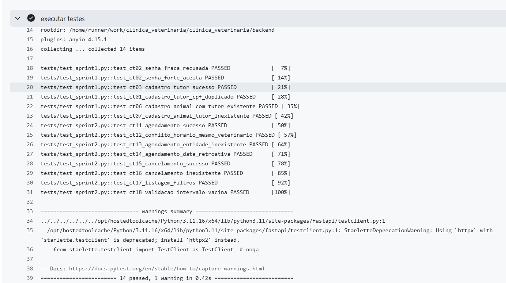

# Evidências de Testes de Software - Sprint 2

**Projeto:** Sistema de Gestão Veterinária (Pet & Gatô)  
**Módulo:** Backend / API REST (Agendamentos e Vacinação)  
**Ambiente de Execução:** Python 3.11 / Python 3.13 / FastAPI / Pytest / GitHub Actions

---

## 1. Matriz de Casos de Teste (Sprint 2)

| ID | Funcionalidade | Cenário / Entrada | Resultado Esperado | Status |
| :--- | :--- | :--- | :--- | :---: |
| **CT11** | Agendamento de Consulta | Dados válidos, tutor e animal existentes em horário livre | Status 201 Created + ID gerado | Aprovado |
| **CT12** | Conflito de Horário | Tentativa de agendamento no mesmo horário para o mesmo veterinário | Status 409 Conflict + mensagem de indisponibilidade | Aprovado |
| **CT13** | Integridade Relacional | Agendamento vinculado a tutor ou animal inexistente no sistema | Status 404 Not Found + detalhe da entidade ausente | Aprovado |
| **CT14** | Validação Temporal | Agendamento com data e hora retroativas | Status 400 Bad Request ("não permitido datas retroativas") | Aprovado |
| **CT15** | Cancelamento | Cancelamento de agendamento previamente registrado | Status 200 OK + status atualizado para "CANCELADO" | Aprovado |
| **CT16** | Cancelamento Inválido | Tentativa de cancelamento de ID de agendamento inexistente | Status 404 Not Found | Aprovado |
| **CT17** | Listagem e Filtros | Consulta de agendamentos com parâmetros de veterinário e status | Status 200 OK + lista filtrada correspondente | Aprovado |
| **CT18** | Regra de Vacinação | Agendamento de vacina com intervalo inferior a 21 dias da última dose | Status 400 Bad Request + aviso de intervalo mínimo | Aprovado |

---

## 2. Evidências de Execução

### 2.1. Execução Local dos Testes Automatizados (VS Code)

Testes automatizados executados na máquina de desenvolvimento via Pytest, garantindo a regressão dos endpoints da Sprint 1 e a validação integral das novas regras de negócio da Sprint 2:

> **Resultado:** 100% dos testes executados e aprovados com sucesso no ambiente local (14 passed: 6 herdados da Sprint 1 e 8 novos da Sprint 2).

### 2.2. Integração Contínua (GitHub Actions - Pull Request)

Validação automatizada disparada via workflow do GitHub Actions no Pull Request da Sprint 2, garantindo conformidade com a branch base (`main`) antes do merge:

> **Resultado:** Pipeline concluído com status aprovado (*All checks have passed*) e sem conflitos com a branch base (*No conflicts with base branch*), liberando a integração.

### 2.3. Log Detalhado da Execução no Servidor de CI

Registro de execução da etapa `executar testes` dentro do container Linux (Ubuntu / Python 3.11.16) no GitHub Actions:

> **Resultado:** Execução completa da suíte com código de saída 0 (sucesso), validando o ciclo completo de testes unitários e de integração no ambiente de CI.
